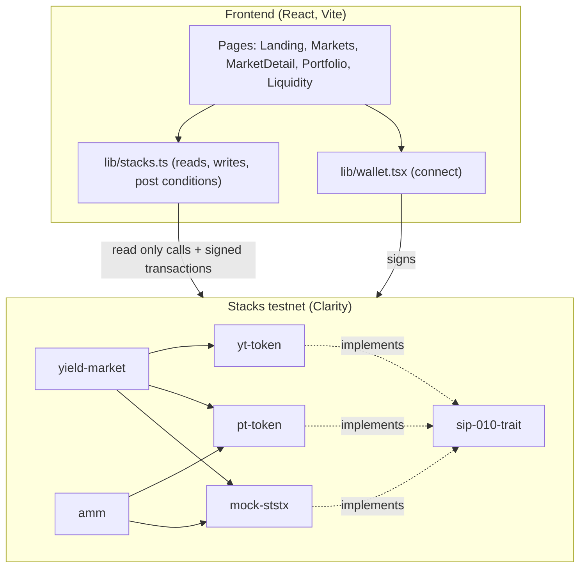
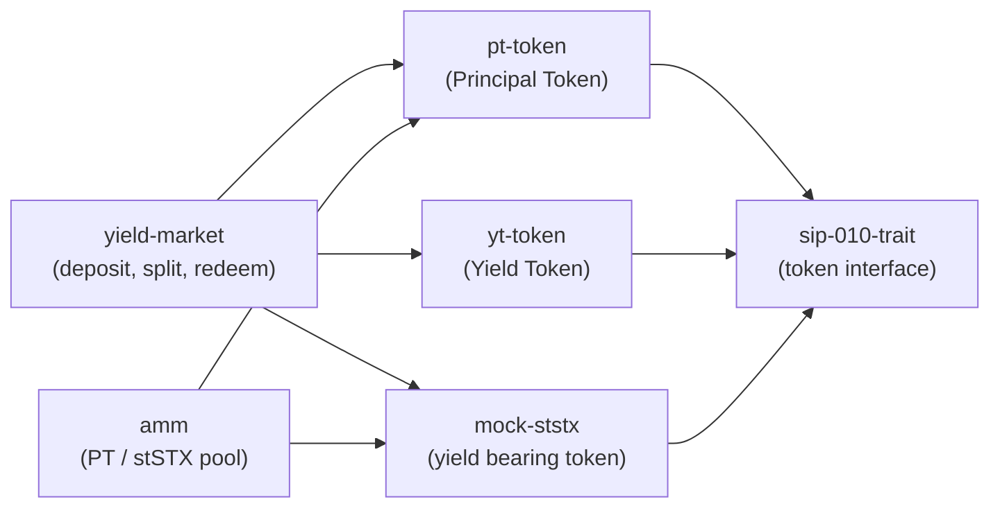
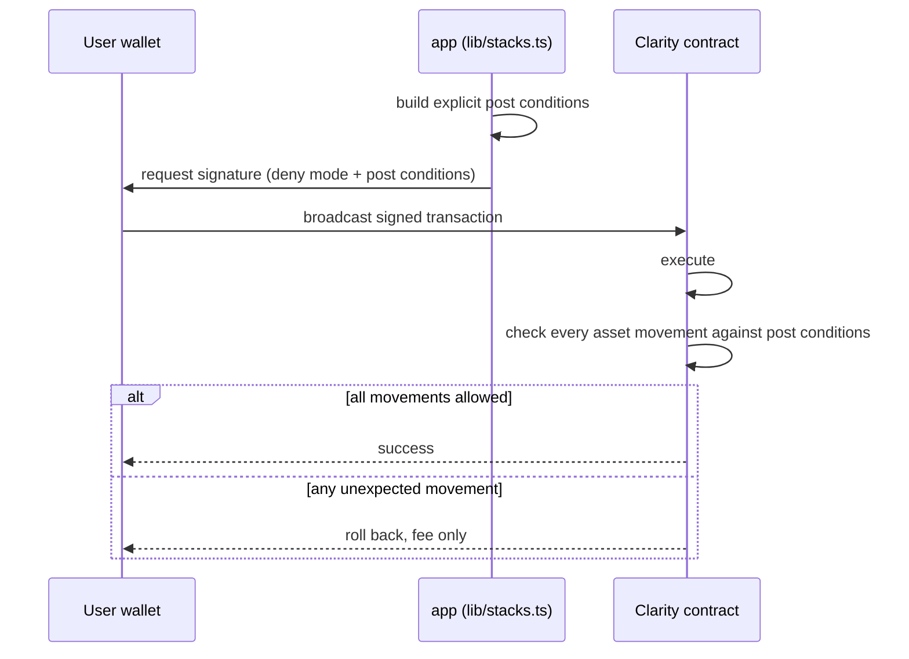
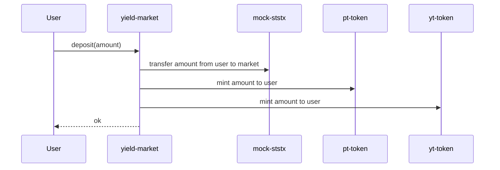
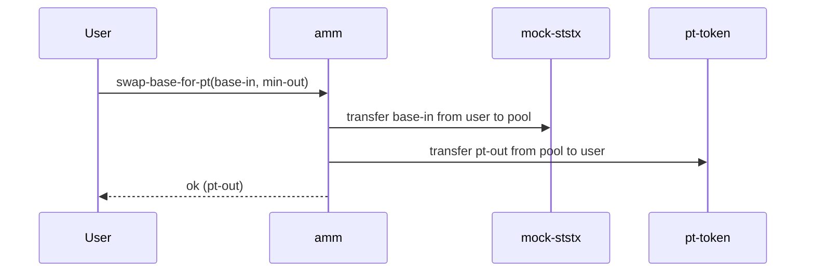
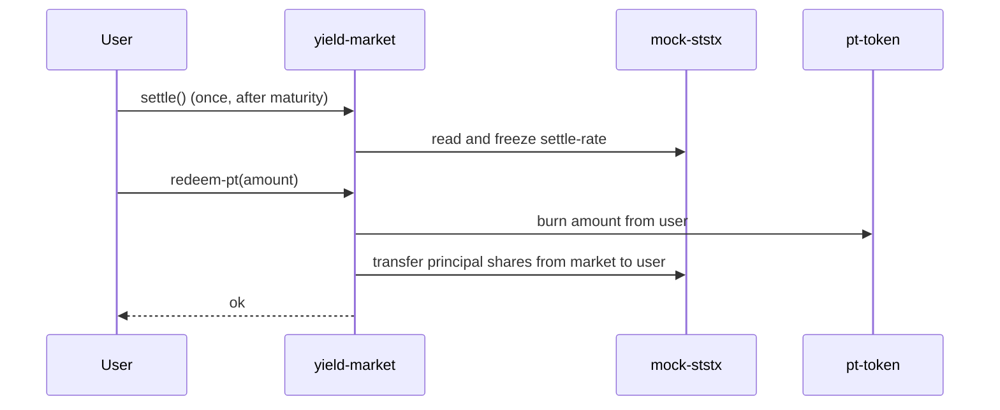

# Stackstrip Architecture

This document explains the full system: the contracts, the yield accounting model,
the market, the safety guarantees, and how the frontend talks to all of it. It is
written to be read top to bottom.

## 1. System overview

Stackstrip has three layers: the Clarity contracts on Stacks, a typed data and
transaction layer in the app, and the React user interface.



The contracts hold all value and enforce all rules. The app never holds funds. It
reads chain state and asks the wallet to sign transactions.

## 2. The contracts

There are six contracts. Five are product contracts and one is a shared trait.



### 2.1 sip-010-trait

The standard fungible token interface on Stacks. Defining it once means PT, YT, and
the mock token are all real tokens that wallets and other protocols understand.

### 2.2 mock-ststx

A stand in for stSTX on testnet. It is a SIP-010 token with one extra idea: an
exchange rate that starts at 1.0 and only ever grows. The growth represents the
Bitcoin yield accruing over time.

Key state and functions:

- `exchange-rate`, scaled by 1e8, starts at 1.0.
- `get-exchange-rate`, reads the current rate.
- `set-exchange-rate`, owner only, can raise the rate but never lower it.
- `mint`, an open faucet so anyone can get test tokens.

On mainnet this contract is replaced by the real stSTX from StackingDAO.

### 2.3 pt-token and yt-token

The Principal Token and the Yield Token. Both are SIP-010 tokens whose minting and
burning are locked to one address, the market contract.

- `set-minter`, callable once by the deployer, hands minting authority to the
  market and then locks. After this, only the market can create or destroy PT and YT.
- `mint` and `burn`, callable only by the locked minter.
- `transfer` and the standard read only functions.

This lock is what makes PT and YT trustworthy: no one can print them except the
market, and only against a real deposit.

### 2.4 yield-market

The heart of the protocol. It takes deposits, mints PT and YT, and handles
redemption after maturity.

State:

- `maturity`, the block height at which the market matures.
- `start-rate`, the mock-ststx exchange rate captured at initialization.
- `settle-rate`, the exchange rate frozen at maturity.
- `initialized` and a settled flag derived from `settle-rate`.

Functions:

- `initialize(maturity-height)`, owner only, sets the maturity and records the
  start rate.
- `deposit(amount)`, pulls `amount` of the underlying from the user and mints
  `amount` of PT and `amount` of YT to them.
- `settle()`, callable once after maturity, freezes `settle-rate` to the current rate.
- `redeem-pt(amount)`, burns PT and returns the principal share of the underlying.
- `redeem-yt(amount)`, burns YT and returns the yield share of the underlying.

### 2.5 amm

A constant product market, the same math as a basic Uniswap pool, pairing PT with
the underlying. This gives PT a price, which is what sets the fixed yield.

- `add-liquidity(base-amt, max-pt)`, adds both tokens at the pool ratio and mints
  LP shares.
- `remove-liquidity(lp-amt)`, burns LP shares and returns both tokens.
- `swap-base-for-pt(base-in, min-out)` and `swap-pt-for-base(pt-in, min-out)`, swap
  with a 0.3 percent fee that stays in the pool for liquidity providers.
- `get-reserves`, `quote-base-for-pt`, `get-lp-shares`, `get-total-lp`, read only.

## 3. The yield accounting model

This is the core financial logic. It is intentionally simple and provably solvent.

The mock token exposes an exchange rate. The market captures it at two moments:

- `start-rate`, the rate when the market opens.
- `settle-rate`, the rate frozen at maturity.

For every unit deposited, the market mints one PT and one YT. At settlement, for an
amount A of tokens redeemed:

```
redeem 1 PT  ->  start-rate / settle-rate   shares   (the principal)
redeem 1 YT  ->  (settle-rate - start-rate) / settle-rate   shares   (the yield)
```

The two always sum back to one share:

```
start/settle  +  (settle - start)/settle  =  1
```

So the pool can always pay everyone exactly what they are owed, and never more. The
principal and the yield are cleanly separated, and the contract cannot become
insolvent through redemption.

Worked example. A user deposits 100 tokens at a start rate of 1.0. The rate grows to
1.09 by maturity, a 9 percent yield. After settlement:

- 100 PT redeem for `100 * 1.0 / 1.09` which is about 91.7 shares, worth 100 at the
  settle rate, the original principal.
- 100 YT redeem for `100 * 0.09 / 1.09` which is about 8.26 shares, worth 9, the yield.

A known limitation of the simple model: all deposits are treated as entering at the
market start rate. Per deposit rate accounting is a later improvement. This is
documented in the contract.

## 4. The market and the fixed yield

The amm prices PT against the underlying. Because PT always redeems for one at
maturity, its market price below one is exactly the fixed return:

```
fixed return to maturity = (1 / PT price) - 1
```

Buying PT at 0.92 stSTX locks in about an 8.7 percent gain at maturity, regardless
of what the variable rate does in between. The frontend computes and shows this live.

## 5. Safety: post conditions

Stacks lets a transaction declare exactly which assets may move, and rejects the
transaction if anything else moves. Stackstrip uses this on every write, in deny
mode, so the wallet enforces the rules independently of the contract.



Examples:

- Deposit asserts the user sends exactly the stSTX amount in. PT and YT are mints,
  which need no condition.
- Buy PT asserts the user sends exactly the stSTX in, and the market sends at least
  the slippage protected PT out, computed from a live quote.
- Redeem asserts the market returns at least the slippage protected stSTX.

If anything does not match, the transaction rolls back and only the network fee is
spent. The user is never exposed to an unexpected asset movement.

## 6. Key flows

Deposit and split:



Swap, buy PT:



Redeem after maturity:



## 7. The frontend data layer

All chain access lives in `lib/stacks.ts`. It has three responsibilities.

Reads. It calls read only contract functions and converts the Clarity values to
plain numbers. Because the public testnet node can be slow, reads are wrapped with a
short cache and retries, and on a total failure they serve the last good value
rather than blanking the interface to zero.

Writes. Each action builds the right post conditions and asks the wallet to sign in
deny mode. The functions are small and named for what they do: `faucet`, `deposit`,
`swapBaseForPt`, `swapPtForBase`, `addLiquidity`, `removeLiquidity`, `settle`,
`redeemPt`, `redeemYt`.

Activity. It reads the user recent transactions from the Hiro API and labels them
for the activity feed.

The wallet layer, `lib/wallet.tsx`, wraps Stacks Connect and exposes the connected
address to the whole app through React context.

## 8. What is mock and what is real

- Real: the Clarity logic, the split and redeem math, the market, the post
  conditions, the deployment on testnet, and every balance and reserve shown in the
  app.
- Mock for now: the underlying token is a stand in for stSTX so the demo is self
  contained and free. On mainnet it is replaced by the real stSTX from StackingDAO,
  with no change to the rest of the system.

## 9. Roadmap

- Integrate real stSTX as the underlying.
- A proper yield pricing market with implied yield and time decay.
- Multiple maturities and long dated markets.
- Mainnet deployment and an audit.
- A reusable fixed income primitive that other Stacks protocols can build on.
