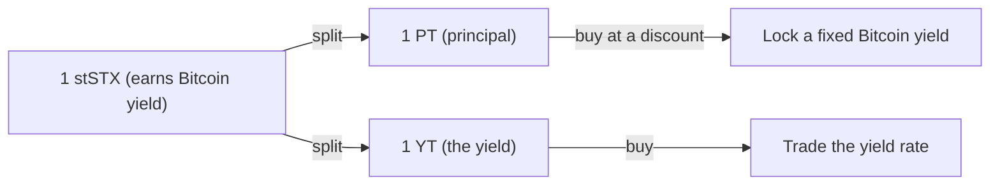
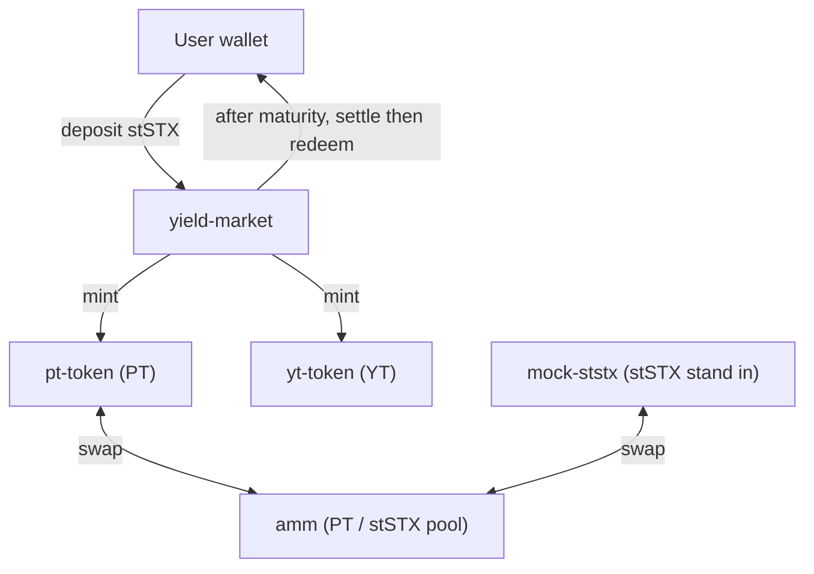

# Stackstrip

Fixed income for native Bitcoin yield, built on Stacks.

Stackstrip takes a token that earns native Bitcoin staking yield and splits it into
two tradable pieces, so anyone can lock in a fixed Bitcoin yield or trade the yield
on its own. It is a Bitcoin native version of what Pendle does for Ethereum, but
built on the real, native Bitcoin yield that Stacks produces through Proof of
Transfer, paid in actual Bitcoin with no wrapping and no bridging.

Status: live on Stacks testnet, with a working app and a passing test suite.

Live app: https://stackstrip.vercel.app

## The idea in plain words

Think of stSTX as a Bitcoin savings account: hold it and it earns yield, paid in
Bitcoin. Stackstrip splits one savings account into two separate tickets:

- PT, the Principal Token: a claim on the original money, redeemable one to one at a
  fixed maturity date. Like a bond with no coupon.
- YT, the Yield Token: a claim on all the yield earned until maturity.



Buy PT below par and you have locked a fixed return, because PT always redeems for
one at maturity. Buy YT and you are taking a position on the yield rate. A built in
market sets the price of each.

## Why it matters

Bitcoin has plenty of variable yield, but no way to fix it or trade it on Stacks.
Fixed rate Bitcoin yield exists elsewhere only on wrapped, bridged Bitcoin on other
chains, where the yield comes from restaking and incentives. There is no fixed
income market for the native Bitcoin yield that Stacks produces through Proof of
Transfer, paid in real Bitcoin with no bridging. Stackstrip creates it, where that
native yield actually lives.

## Features

- Split a yield bearing token into Principal and Yield tokens.
- Trade PT against the underlying through a constant product market.
- Provide and remove liquidity, and earn the trading fee.
- Settle at maturity, then redeem PT for principal and YT for the accrued yield.
- A live app with real on chain balances, reserves, an activity feed, and toasts.
- Every write is protected by explicit Clarity post conditions.

## How it works, end to end



1. A user deposits stSTX into the market and receives equal amounts of PT and YT.
2. PT trades against stSTX in the market, which sets the fixed yield.
3. At maturity the market is settled once, which freezes the final rate.
4. PT holders redeem for principal, YT holders redeem for the yield that accrued.

## Tech stack

- Smart contracts: Clarity, tested with Clarinet and the Clarinet SDK.
- Frontend: React, TypeScript, Vite, Tailwind, Framer Motion, Recharts.
- Chain access: Stacks.js for wallet connection, reads, and writes.
- Network: Stacks testnet.

## Repository layout

```
stackstrip/
  contracts/            Clarinet project
    contracts/          the Clarity source
      sip-010-trait.clar
      mock-ststx.clar
      pt-token.clar
      yt-token.clar
      yield-market.clar
      amm.clar
    tests/              Vitest tests for the contracts
  frontend/             the Vite React app
    src/
      lib/stacks.ts     the contract and data layer
      lib/wallet.tsx    wallet connection
      pages/            Landing, Markets, MarketDetail, Portfolio, Liquidity
      components/       layout and UI
```

## Live testnet contracts

Deployer: `ST1D9X179MAJ9XA7KHSZJ48CN39DVB6TAQDYST34R`

| Contract name | Contract id | Purpose |
|---|---|---|
| `mock-ststx` | `ST1D9X179MAJ9XA7KHSZJ48CN39DVB6TAQDYST34R.mock-ststx` | A yield bearing token used as the stSTX stand in on testnet |
| `pt-token` | `ST1D9X179MAJ9XA7KHSZJ48CN39DVB6TAQDYST34R.pt-token` | The Principal Token (SIP-010) |
| `yt-token` | `ST1D9X179MAJ9XA7KHSZJ48CN39DVB6TAQDYST34R.yt-token` | The Yield Token (SIP-010) |
| `yield-market` | `ST1D9X179MAJ9XA7KHSZJ48CN39DVB6TAQDYST34R.yield-market` | Deposit, split, settle, and redeem |
| `amm` | `ST1D9X179MAJ9XA7KHSZJ48CN39DVB6TAQDYST34R.amm` | A constant product market for PT against stSTX |

Explorer: https://explorer.hiro.so/address/ST1D9X179MAJ9XA7KHSZJ48CN39DVB6TAQDYST34R?chain=testnet

## Running it locally

Contracts:

```
cd contracts
npm install
npm test            # run the Clarity test suite
clarinet check      # type check the contracts
```

Frontend:

```
cd frontend
npm install
npm run dev         # opens on http://localhost:3000
```

Connect a Stacks wallet set to Testnet, open the Trade page, use the faucet to get
test tokens, then split, trade, and provide liquidity.

## Tests

The contract test suite covers the full lifecycle: minting, splitting into PT and
YT, trading on the market with the fee, providing liquidity, settling at maturity,
and redeeming, with exact yield math checked against expected values.

## More detail

See ARCHITECTURE.md for the full system design, the contract by contract breakdown,
the yield accounting model, and the safety guarantees.

## License

MIT.
